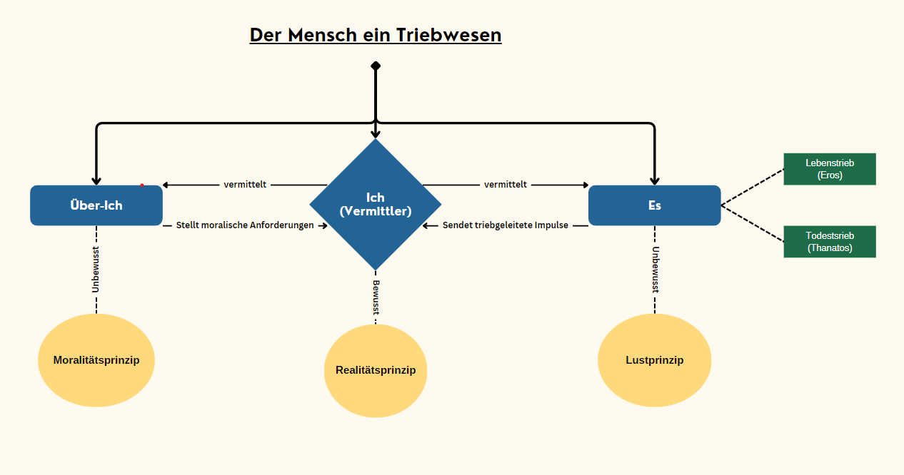

# Der Mensch ein Triebwesen

Wir haben das Thema der Mensch ein Triebwesen im Rahmen des Ethik Unterrichts behandelt.

Aus der Erarbeitung haben wir eine Unterrichtsstunde, welche von uns gehalten wurde, geplant und Erstellt.

**HINWEIS**

Kennzeichnungen:

Unterricht -> Diese Inhalte wurden im Unterricht Verwendet

Vorbereitung -> Inhalte unserer Erarbeitungs Phase, welche einzlene Pordukt des Gesamt produkts ergeben.

## Handout

[Unser Handout zum Thema Triebwesen](Handoutpng)

## Einstieg ins Thema 

[Vergleich Mephisto's und unsere Hypothesen](Einstieg/Hypothesen.md)

## Seelenmodell von Sigmund Freud Texte

Vorbereitung
[Die Texte in den, dass Seelenmodell beschrieben wird.](SigmundFreudTexte)

Unterricht: 

[Seelenmodell Text](SigmundFreudTexte/SigmundFreud_Seelenmodell_Text_Gian-Joshua.pdf) 

Verwendete Quellen:

[1.1] bis [1.8]; 

[2.1] <= [3.1] bis [3.3] zur Vereinfachung des Textes

## Das Seelenmodell als Vorbereitung zum Unterricht

Unterricht und Vorbereitung:

[Das Seelenmodell](SigmundFreud-Tafelbild-Seelenmodell)

## Fallbeispiel: Kastration für Sexualstraftäter

## Quellen

**Disclaimer:**

Alle Quellen wurden am Tag der Präsentation zuletzt überprüft ob diese Weiterhin zugänglich sind. (19.12.2024)
Es wird keine Garantie dafür Übernommen das diese nach dem (19.12.2024) weiterhin zugänglich sind.

**Internet Quellen**

[1.1] https://knowunity.de/knows/ethik-seelenmodell-freud-3b7e234c-c87d-47a9-b90d-6a88b6211acf

[1.2] https://studyflix.de/geschichte/sigmund-freud-5176

[1.3] https://www.youtube.com/watch?v=fjYFRfQh14Q

[1.4] https://www.lerntippsammlung.de/Seelenmodelle-Platon-und-Freud.html

[1.5] https://www.studysmarter.de/schule/psychologie/hauptstroemungen-der-psychologie/instanzenmodell-freud/

[1.6] https://erzieher-kanal.de/instanzenmodell/

[1.7] https://knowunity.de/knows/ethik-freud-kant-5c3bbd5c-503a-4969-84df-4322f13a2914

[1.8] https://de.wikipedia.org/wiki/%C3%9Cber-Ich

[1.9] https://www.faz.net/aktuell/gesellschaft/kriminalitaet/vereinigte-staaten-alabama-beraet-ueber-zwangskastration-14113099.html

**Buch / Papier Quellen**

 [2.1] Sigmund Freud, Abriss der Psychoanalyse, in: Gesammelte Werke, Band 17, S. 67–69

**Sonstige Tools**

[3.1] Gemini

[3.2] ChatGPT

[3.3] PerplexityAI
